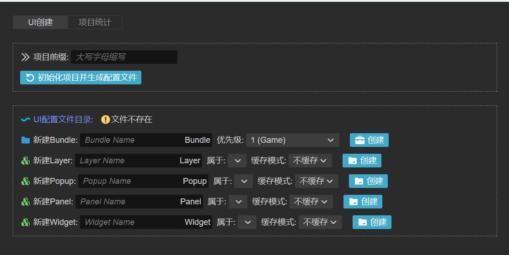
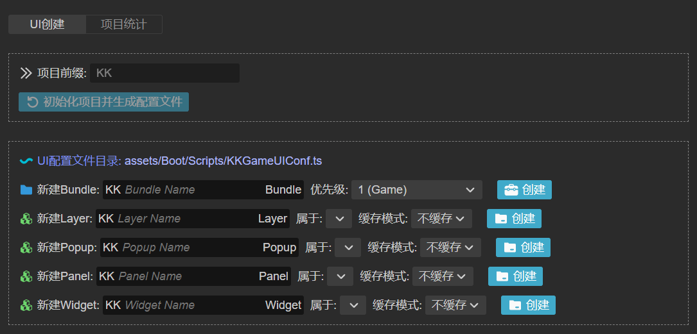
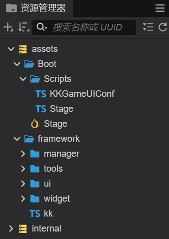
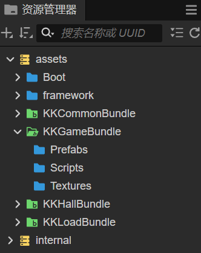
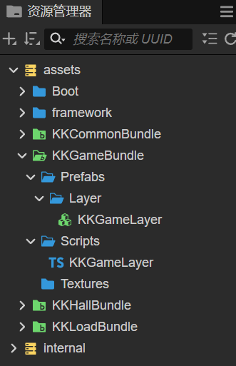
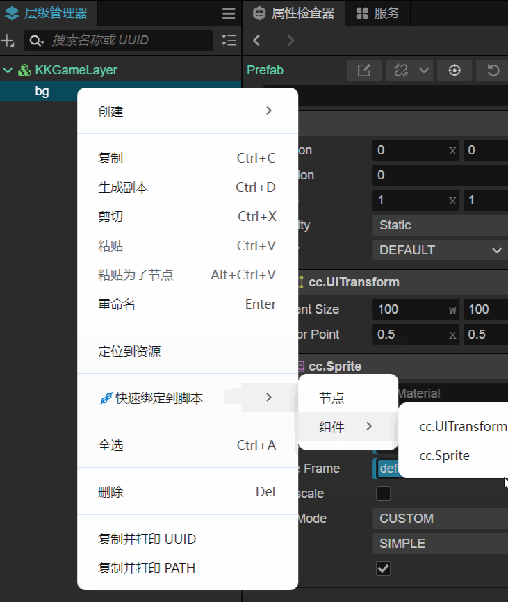
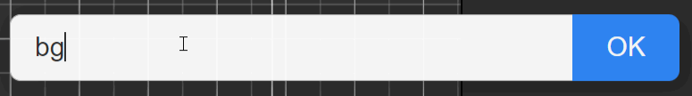
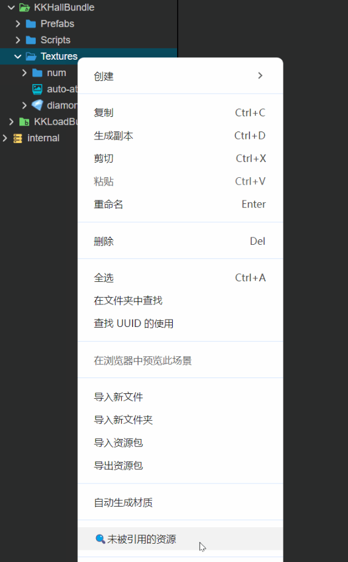
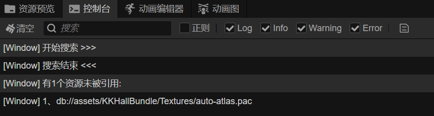
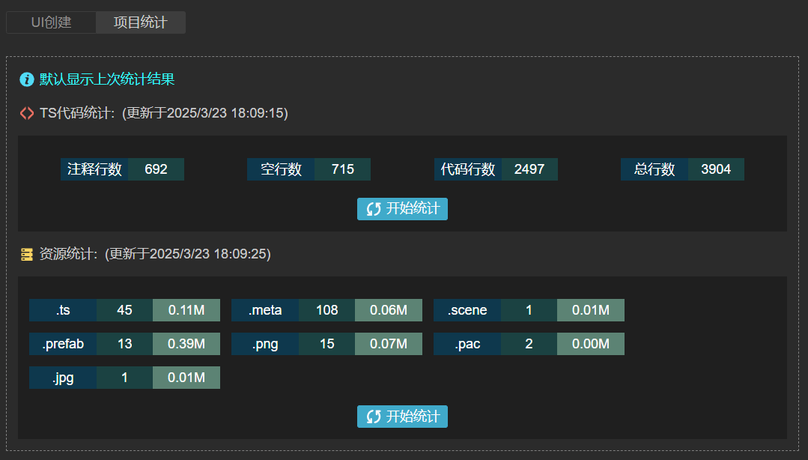

## <center>Cocos-Creator-Async3</center>
<center>


</center>

Cocos-Creator-Async3是一个基于Cocos-creator3.x的轻量级的、异步的、高效的游戏开发框架，它主要有以下特征：
- 单场景、多Layer的UI结构，自动内存管理
- 大部分API都是异步的，代码更直观高效
- 使用引擎的Bundle思想来管理游戏代码和资源
- 提供一些常用的功能模块和通用的解决方案（不需要的功能模块可自行删除）
- 配合插件 **kk-assist** 使用，效率更高，可减少很多重复操作
- 轻量级、很灵活，可在此框架基础上继续封装定制

**简要声明**：
- 本项目基于 Cocos Creator 3.8.x。
- 本项目使用 *MIT License* 开源协议，主要供读者学习参考。

### 基本使用指南
#### 1、前言
使用插件kk-assist，只需点击鼠标即可完成几乎所有的UI创建工作。新建一个空项目，把插件直接拖入工程extensions目录下，在扩展管理器里刷新激活，然后按**快捷键**`CTRL+F12`即可使用。如下图：  


#### 2、初始化项目
输入项目前缀，并点击按钮初始化，后面自动生成的脚本或prefab名字会自动加上前缀。  
  
项目初始化成功后，已经自动打开了创建的场景，并自动为场景附加了启动脚本和适配脚本。资源管理器如下：  


#### 3、创建Bundle
根据需要可通过插件创建各种Bundle，可自定义优先级，资源管理器如下：  


#### 4、创建UI容器
本框架UI基于单场景，在单场景下，有4种类型的UI界面容器：
- Layer：层，用于从一个界面切换到另一个界面，界面元素的主要载体；
- Popup：弹窗，在当前界面弹出一个界面展示窗体；
- Panel：面板，即可用于Layer也可用于Popup，相当于嵌入其中的子视图；
- Widget：控件，主要指一些通用的小的UI模块或功能性挂件；

这些都可通过插件自动创建，插件会自动创建对应的prefab，并自动附加相应的脚本组件。对应UI的配置信息也会自动生成在GameUIConf脚本中，比如创建一个Layer：  
  
通过插件创建完Layer，就可在脚本中调用如下代码切换Layer：  
```typescript
kk.uiMgr.goLayerAsync(KKLayerConf.Game);
```

#### 5、插件其他功能
1、在层级管理器中，右击选中的节点，可快速绑定节点或者节点上任意组件到对应的脚本中，如下图：  
  
右键绑定的时候，会先弹出一个输入框，可自定义变量名，默认为层级管理器里节点的名字。如下图：  
  

2、在资源管理器中，右键文件夹，可搜索当前文件夹下，哪些资源未被场景或预制体所引用。如下图：  
  
搜索结果会在控制台打印，效果如下：  
  

3、还有个小功能，插件可统计项目ts脚本不同代码行数，以及项目不同资源大小，如下：  
  

#### 5、代码使用简介
UI、网络等相关API都是异步的，前面加上await就变成同步的了，示例如下：  
```typescript
kk.uiMgr.goLayerAsync(KKLayerConf.Load);
kk.uiMgr.goLayerAsync(KKLayerConf.Hall, data);

kk.uiMgr.showPopupAsync(KKHallPopupConf.Setup);
kk.uiMgr.showPopupAsync(KKHallPopupConf.Setup, data);
let ret = await kk.uiMgr.showPopupAsync(KKHallPopupConf.Setup);
kk.uiMgr.showPopupAsync(KKHallPopupConf.Setup).then((ret) => {
    // do something
}).catch(() => {

});

// 都是异步方法，跟前面不同的是，这两种类型创建后，需要自行设置父节点才会显示。
kk.uiMgr.createPanelAsync(PanelConf.Shop);
let panel = await kk.uiMgr.createPanelAsync(PanelConf.Shop);
panel.parent = this.node;

kk.uiMgr.createWidgetAsync(WidgetConf.Toast);
let wgt = await kk.uiMgr.createWidgetAsync(WidgetConf.Toast);
wgt.parent = this.node;

// http
let ret = await kk.httpMgr.reqAsync(...);
kk.httpMgr.reqAsync(...).then(...).catch(...);

// websocket
await kk.socketMgr.connectAsync(...)
kk.socketMgr.connectAsync(...).then(...).catch(...);
let ret = await kk.socketMgr.reqAsync(...);
kk.socketMgr.reqAsync(...).then(...).catch(...);

kk.socketMgr.on(cmd, callback, target);
kk.socketMgr.off(cmd, callback, target);
```
框架中的**AsyncHelper**脚本也提供了其他一些异步方法，比如异步等待、异步动画、异步分帧处理等。  

详细使用以及其他使用示例请阅读框架源码或运行demo工程查看。  
[更新日志](https://github.com/Mortal-Li/cocos-creator-async3/blob/main/CHANGELOG.md)